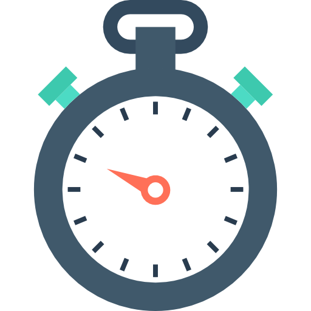
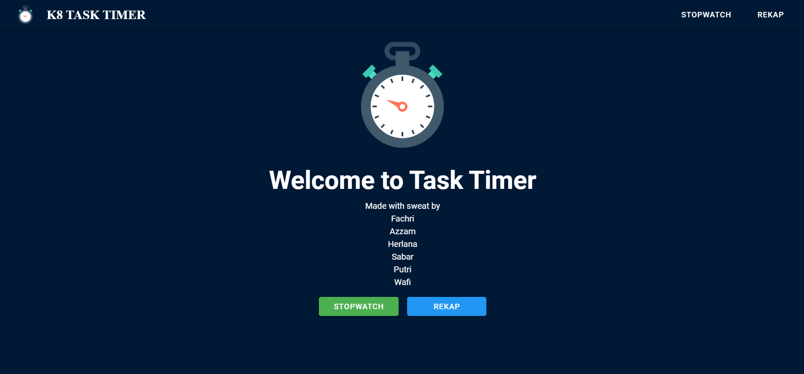
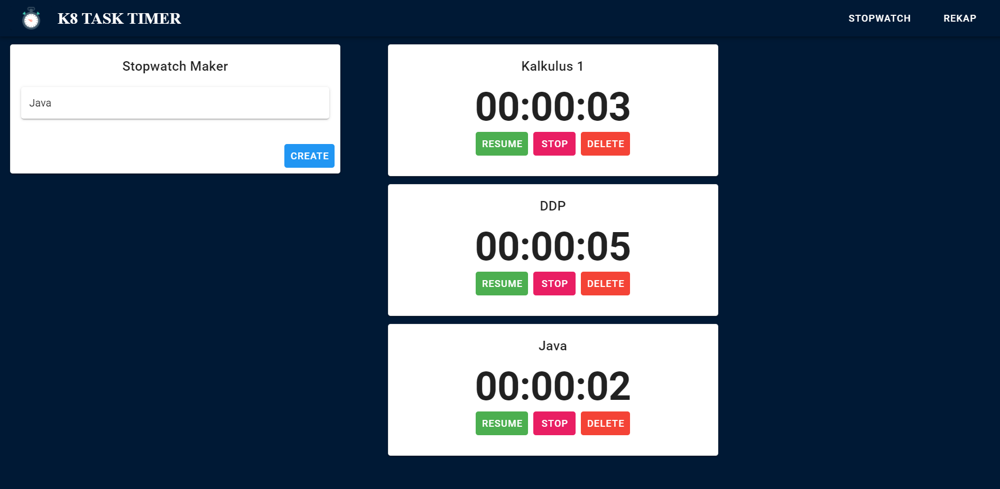
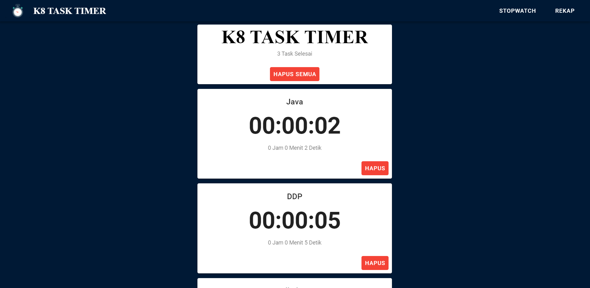

<div id="top"></div>
<!--
*** Thanks for checking out the Best-README-Template. If you have a suggestion
*** that would make this better, please fork the repo and create a pull request
*** or simply open an issue with the tag "enhancement".
*** Don't forget to give the project a star!
*** Thanks again! Now go create something AMAZING! :D
-->


<!-- PROJECT SHIELDS -->
<!--
*** I'm using markdown "reference style" links for readability.
*** Reference links are enclosed in brackets [ ] instead of parentheses ( ).
*** See the bottom of this document for the declaration of the reference variables
*** for contributors-url, forks-url, etc. This is an optional, concise syntax you may use.
*** https://www.markdownguide.org/basic-syntax/#reference-style-links
-->
[![Contributors][contributors-shield]][contributors-url]
[![Forks][forks-shield]][forks-url]
[![Stargazers][stars-shield]][stars-url]
[![Issues][issues-shield]][issues-url]
[![MIT License][license-shield]][license-url]


<!-- PROJECT LOGO -->
<br />
<div align="center">
  <a href="https://github.com/3BD4-Webdev-Kelompok8/NodeJS-Postgre-Stopwatch">
    
  </a>

<h3 align="center">Stopwatch</h3>

  <p align="center">
    K8 Task Timer is a Stopwatch that is used for calculating the time that students need to do their tasks. 
    <br />
    <a href="https://github.com/3BD4-Webdev-Kelompok8/NodeJS-Postgre-Stopwatch"><strong>Explore the docs »</strong></a>
    <br />
    <br />
    <a href="#about-the-project">View Demo</a>
    ·
    <a href="https://github.com/3BD4-Webdev-Kelompok8/NodeJS-Postgre-Stopwatch/issues">Report Bug</a>
    ·
    <a href="https://github.com/3BD4-Webdev-Kelompok8/NodeJS-Postgre-Stopwatch/issues">Request Feature</a>
  </p>
</div>


<!-- TABLE OF CONTENTS -->
<details>
  <summary>Table of Contents</summary>
  <ol>
    <li>
      <a href="#about-the-project">About The Project</a>
      <ul>
        <li><a href="#built-with">Built With</a></li>
      </ul>
    </li>
    <li>
      <a href="#getting-started">Getting Started</a>
      <ul>
        <li><a href="#installation">Installation</a></li>
      </ul>
    </li>
    <li><a href="#usage">Usage</a></li>
    <li><a href="#roadmap">Roadmap</a></li>
    <li><a href="#contributing">Contributing</a></li>
    <li><a href="#license">License</a></li>
    <li><a href="#contact">Contact</a></li>
    <li><a href="#acknowledgments">Acknowledgments</a></li>
  </ol>
</details>


<!-- ABOUT THE PROJECT -->
## About The Project

<div align="center">
<a href="https://github.com/3BD4-Webdev-Kelompok8/NodeJS-Postgre-Stopwatch">
    
</a>
<a href="https://github.com/3BD4-Webdev-Kelompok8/NodeJS-Postgre-Stopwatch">
    
</a>
<a href="https://github.com/3BD4-Webdev-Kelompok8/NodeJS-Postgre-Stopwatch">
    
</a>
</div>
<!-- [![Product Name Screenshot][product-screenshot]](https://example.com) -->

###### Mini Project Web Development Course

This project is a mini project as an assignment for the Web Development course. In this project, we implement the use of Node JS and Postgre SQL for Backend and use Vue JS and Vuetify for Frontend. This Stopwatch has some features, those are:

* You can create a new Stopwatch for the new task and also you can give it a name of the Stopwatch according to the task.
* You can start and pause the Stopwatch.
* You can stop and delete the Stopwatch and the history will be included in the Rekap page.
* You can view the Stopwatch history on the Rekap page.
* You can delete one or delete all the Stopwatch history.
* If one task is running and you want to start another task or new task, then the running stopwatch will be paused and the other will be start.
* And also this Stopwatch can run when the tab is closed.

This project is still running and needs some improvements and also the addition of some features. I hope this project can help your task.

<p align="right">(<a href="#top">back to top</a>)</p>


### Built With

* HTML
* CSS
* Node JS
* PostgreSQL
* Vue JS
* Vuetify

<p align="right">(<a href="#top">back to top</a>)</p>


<!-- GETTING STARTED -->
## Getting Started

This will give instructions on setting up your project locally. To get a local copy up and running follow these simple example steps.

### Installation

1. Clone the repo
   ```sh
   https://github.com/3BD4-Webdev-Kelompok8/NodeJS-Postgre-Stopwatch.git
   ```
2. Create .env file and put this
   ```sh
    DB_HOST= {your host }
    DB_USER= {your db user }
    DB_PASSWORD= {your db password }
    DB_DATABASE= {your db database }
    PORT= {your host port }
    DATABASE_PORT= { your db port }
   ```
4. Open two terminals to the project folder, then:
    ```sh
    cd server
    nodemon server
   ```
   ```sh
   cd client
   npm run serve
   ```

<p align="right">(<a href="#top">back to top</a>)</p>


<!-- USAGE EXAMPLES -->
## Usage

To use this application, there are some features, those are:

1. Use the Create button to create the Stopwatch and you can give it a name according to the task.
2. Use the Start button to start the Stopwatch.
3. Use the Pause button to pause the Stopwatch.
4. Use the Delete button to delete the Stopwatch.
5. Use the Stop button to stop the Stopwatch and display will show the total elapsed time.
6. Rekap page will show your Stopwatch history.

<p align="right">(<a href="#top">back to top</a>)</p>


<!-- ROADMAP -->
## Roadmap

1. Analysis
2. Collect and define requirement
3. Development HTML and CSS
4. Add Javascript for Stopwatch function
5. Add local storage to keep Stopwatch running in the background
6. Use Postgre SQL for the database and Node JS for Backend (Server)
7. Use Vue JS for Frontend (Client)

See the [open issues](https://github.com/3BD4-Webdev-Kelompok8/NodeJS-Postgre-Stopwatch/issues) for a full list of proposed features (and known issues).

<p align="right">(<a href="#top">back to top</a>)</p>


<!-- CONTRIBUTING -->
## Contributing

Contributions are what make the open source community such an amazing place to learn, inspire, and create. Any contributions you make are **greatly appreciated**.

If you have a suggestion that would make this better, please fork the repo and create a pull request. You can also simply open an issue with the tag "enhancement".
Don't forget to give the project a star! Thanks again!

1. Fork the Project
2. Create your Feature Branch (`git checkout -b /3BD4-Webdev-Kelompok8/NodeJS-Postgre-Stopwatch`)
3. Commit your Changes (`git commit -m 'Add some NodeJS-Postgre-Stopwatch'`)
4. Push to the Branch (`git push origin /3BD4-Webdev-Kelompok8/NodeJS-Postgre-Stopwatch`)
5. Open a Pull Request

<p align="right">(<a href="#top">back to top</a>)</p>


<!-- LICENSE -->
## License

Distributed under the MIT License. See `LICENSE.txt` for more information.

<p align="right">(<a href="#top">back to top</a>)</p>


<!-- CONTACT -->
## Contact

Project Link: [https://github.com/3BD4-Webdev-Kelompok8/NodeJS-Postgre-Stopwatch)

Project Group: Group 8 - D4 3B - WebDev 2021

Members:

* [Azzam Badruz Zaman - 191524035](https://github.com/Azzambz)
* [Fachri Dhia Fauzan - 191524041](https://github.com/fachdf)
* [Herlana - 191524045](https://github.com/Soherlana)
* [Putri Syalwa Abdillah - 191524054](https://github.com/putrisylw)
* [Sabar Muhamad Itikap - 191524058](https://github.com/sabarmitikap)
* [Wafi Khoerun - 191524064](https://github.com/wafikhn)


<p align="right">(<a href="#top">back to top</a>)</p>


<!-- ACKNOWLEDGMENTS -->
## Acknowledgments

* [Readme Template](https://github.com/othneildrew/Best-README-Template)

<p align="right">(<a href="#top">back to top</a>)</p>


<!-- MARKDOWN LINKS & IMAGES -->
<!-- https://www.markdownguide.org/basic-syntax/#reference-style-links -->
[contributors-shield]: https://img.shields.io/github/contributors/3BD4-Webdev-Kelompok8/NodeJS-Postgre-Stopwatch.svg?style=for-the-badge
[contributors-url]: https://github.com/3BD4-Webdev-Kelompok8/NodeJS-Postgre-Stopwatch/graphs/contributors
[forks-shield]: https://img.shields.io/github/forks/3BD4-Webdev-Kelompok8/NodeJS-Postgre-Stopwatch.svg?style=for-the-badge
[forks-url]: https://github.com/3BD4-Webdev-Kelompok8/NodeJS-Postgre-Stopwatch/network/members
[stars-shield]: https://img.shields.io/github/stars/3BD4-Webdev-Kelompok8/NodeJS-Postgre-Stopwatch.svg?style=for-the-badge
[stars-url]: https://github.com/3BD4-Webdev-Kelompok8/NodeJS-Postgre-Stopwatch/stargazers
[issues-shield]: https://img.shields.io/github/issues/3BD4-Webdev-Kelompok8/NodeJS-Postgre-Stopwatch.svg?style=for-the-badge
[issues-url]: https://github.com/3BD4-Webdev-Kelompok8/NodeJS-Postgre-Stopwatch/issues
[license-shield]: https://img.shields.io/github/license/3BD4-Webdev-Kelompok8/NodeJS-Postgre-Stopwatch.svg?style=for-the-badge
[license-url]: https://github.com/3BD4-Webdev-Kelompok8/NodeJS-Postgre-Stopwatch/blob/master/LICENSE.txt

[product-screenshot]: images/screenshot.png
